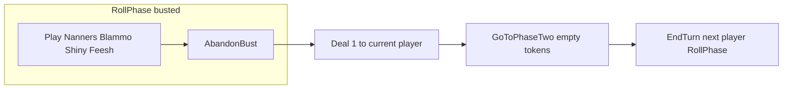

# Bust: draw one, skip tokens, end turn

## Current behavior (baseline)

- While **busted** in [`GameSession.GetAllowedActionsForPlayer`](c:\Users\Seth\Source\Repos\TrashAnimal\TrashAnimal\GameSession.cs), allowed actions are: handlers from [`_rollPhaseHandlers.All`](c:\Users\Seth\Source\Repos\TrashAnimal\TrashAnimal\GameSession.cs) (e.g. Nanners, Blammo, Shiny, Feesh when actionable) **plus** `GameAction.AbandonBust`. There is **no** `AdvanceToResolveTokens` in the bust branch (only the non-busted branch adds it at lines 145–146).
- `AbandonBust` currently delegates to [`TryAdvanceToResolveTokens`](c:\Users\Seth\Source\Repos\TrashAnimal\TrashAnimal\GameSession.cs), which for a bust calls `GoToPhaseTwo(CurrentPlayerIndex, Array.Empty<TokenAction>())`. [`GoToPhaseTwo`](c:\Users\Seth\Source\Repos\TrashAnimal\TrashAnimal\GameSession.cs) with **zero** tokens clears the token coordinator and sets `GameState.TurnEnd` **without** entering `TokenPhase` (lines 327–331).
- So the **rules gap** relative to your request is: **no draw**, and the CLI shows the raw enum name (`AbandonBust`). The **UX gap** is: the game loop still stops at `TurnEnd` and prompts for [`GameAction.EndTurn`](c:\Users\Seth\Source\Repos\TrashAnimal\TrashAnimal\Program.cs) (lines 68–78); this change will **auto-invoke** `EndTurn()` so the next player is active without that prompt.

## Recommended implementation

### 1. Game action: keep `AbandonBust`, update comment only

- **Do not rename** `GameAction.AbandonBust` in [`GameAction.cs`](c:\Users\Seth\Source\Repos\TrashAnimal\TrashAnimal\GameAction.cs); the name does not need to encode every behavioral detail.
- Refresh the enum comment to describe the new behavior: bust-only resolution path—draw one from the deck, skip token phase, end turn immediately (no separate `EndTurn` choice).

### 2. Session logic: `TryBustAndEndTurn` in `GameSession` only

- Add **`TryBustAndEndTurn(out string? error)`** on [`GameSession`](c:\Users\Seth\Source\Repos\TrashAnimal\TrashAnimal\GameSession.cs) and route the `GameAction.AbandonBust` branch in `ApplyAction` to it (instead of `TryAdvanceToResolveTokens`).
- **No partial classes** for this work: keep the implementation in the existing `GameSession` type (same file as today). File-length pressure can be addressed later via the subplan below or a separate refactor pass.
- Preconditions: `State == GameState.RollPhase` and `PhaseOne.IsBusted` (same intent as bust path in `TryAdvanceToResolveTokens`).
- **Draw**: same pattern as [`TokenPhaseTokenResolver.TryStashTrashDraw`](c:\Users\Seth\Source\Repos\TrashAnimal\TrashAnimal\TokenPhase\Services\TokenPhaseTokenResolver.cs): `DrawPile.DealCards(1)` and `CurrentPlayer.AddCards(..., markReceivedOnOwnerCurrentTurn: true)`. Empty deck remains valid (zero cards drawn).
- **Skip tokens**: `GoToPhaseTwo(CurrentPlayerIndex, Array.Empty<TokenAction>())` (today’s bust outcome).
- **Auto end turn**: immediately call **`EndTurn()`** after that transition so `ApplyAction` returns with the **next** player in **`RollPhase`** and no `TurnEnd` prompt. `EndTurn()` requires `TurnEnd` first; `GoToPhaseTwo` with zero tokens sets `TurnEnd`, then `EndTurn()` advances `CurrentPlayerIndex` and `BeginTurn()` (including `PhaseOne.Reset()`).

### 3. CLI label: local function inside `ChooseAction`

- In [`CliHumanController.ChooseAction`](c:\Users\Seth\Source\Repos\TrashAnimal\TrashAnimal\CliHumanController.cs), define a **nested local function** (e.g. `string Label(GameAction a)`) inside the method body—not a private static helper—that returns **"Busted: Draw one card and end turn."** when `a == GameAction.AbandonBust`, and otherwise `a.ToString()` (or equivalent). Use `Label(allowedActions[i])` when printing the menu.

### 4. Tests

- Keep assertions on **`GameAction.AbandonBust`** (no enum rename).
- Add or extend tests so that after `AbandonBust`: hand gains one card when the deck can deal; session is **`RollPhase`** for the **next** player; **`CurrentPlayerIndex`** advanced; never entered **`TokenPhase`**. Optional: empty-deck case (no draw, transition still valid).

### 5. Optional / out of scope unless you want parity

- [`AiController`](c:\Users\Seth\Source\Repos\TrashAnimal\TrashAnimal\AiController.cs): no change required unless you want bust-specific bot bias.
- [`TrashAnimal/scenarios.txt`](c:\Users\Seth\Source\Repos\TrashAnimal\TrashAnimal\scenarios.txt): align wording if you treat it as living spec (draw + auto next player vs. old “TokenPhase” phrasing for zero tokens).

---

## Subplan (deferred): unified `GameAction` dispatcher for RollPhase and TokenPhase

**Goal:** Reduce duplication between roll-phase handling in `GameSession` (switches, handler registry) and token-phase dispatch in [`TokenPhaseGameActionDispatcher`](c:\Users\Seth\Source\Repos\TrashAnimal\TrashAnimal\TokenPhase\Services\TokenPhaseGameActionDispatcher.cs)—both phases involve overlapping card-driven actions (e.g. Shiny, Feesh) and similar “apply `GameAction`” patterns.

**Direction (for a later PR, not part of the bust change):**

- Introduce an abstraction (e.g. `IGameActionDispatcher` or phase-specific facades behind one coordinator) that can route `GameAction` values appropriate to the current `GameState`, delegating to existing roll handlers and token-phase services where overlap exists.
- Migrate incrementally: start by extracting shared helpers (draw-one-to-current-player, common validation), then unify dispatch tables if it stays readable.
- Preserve testability: keep interfaces small and inject or construct dispatchers from `GameSession` / `TokenPhaseCoordinator` rather than growing static entry points.

This subplan is **tracking only** until you schedule the refactor; the bust feature should land without waiting on it.

## Summary

| Area | Change |
|------|--------|
| `GameAction` | Keep `AbandonBust`; update comment only. |
| Session | New `TryBustAndEndTurn`; `AbandonBust` → draw one, `GoToPhaseTwo(empty)`, `EndTurn()` in one action; all in `GameSession` (no partials). |
| CLI | Nested **local function** in `ChooseAction` for the bust menu line. |
| Tests | `AbandonBust` + auto next player + draw + no token phase. |
| Later | Subplan above for Roll + Token dispatcher elegance. |
