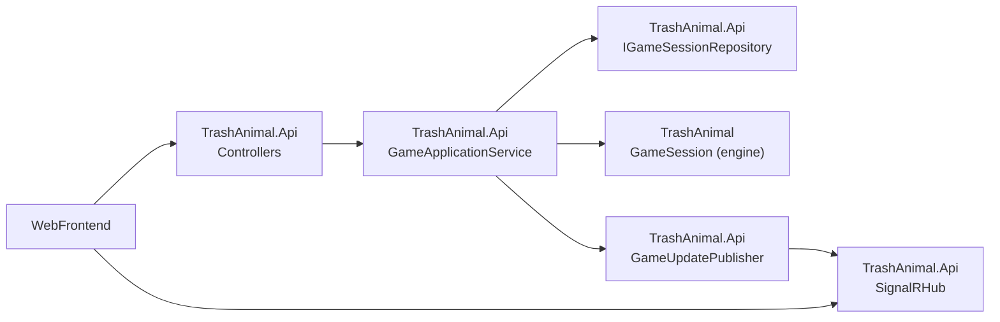

# CLI Game to REST + Web Plan

## Goal and Constraints
- Keep `GameSession` and phase logic as the domain engine, and move transport concerns (HTTP, websocket, auth/session mapping) into a host layer.
- First milestone supports one playable web game end-to-end.
- Design from day one for easy upgrade to multiple concurrent game sessions and user identity mapping.

## TrashAnimal Engine Seams (consumed by TrashAnimal.Api)
- Core command entrypoint: [`TrashAnimal/GameSession.cs`](c:/Users/Seth/Source/Repos/TrashAnimal/TrashAnimal/GameSession.cs) via `ApplyAction(...)` and `Try*` methods.
- Core read models: [`TrashAnimal/GameView.cs`](c:/Users/Seth/Source/Repos/TrashAnimal/TrashAnimal/GameView.cs), [`TrashAnimal/TokenPhaseView.cs`](c:/Users/Seth/Source/Repos/TrashAnimal/TrashAnimal/TokenPhaseView.cs), [`TrashAnimal/StealPhaseView.cs`](c:/Users/Seth/Source/Repos/TrashAnimal/TrashAnimal/StealPhaseView.cs).
- CLI bootstrap (not carried forward): [`TrashAnimal/Program.cs`](c:/Users/Seth/Source/Repos/TrashAnimal/TrashAnimal/Program.cs) — logic is superseded by `TrashAnimal.Api`.
- Phase orchestration to keep internal to engine: [`TrashAnimal/TokenPhase/TokenPhaseCoordinator.cs`](c:/Users/Seth/Source/Repos/TrashAnimal/TrashAnimal/TokenPhase/TokenPhaseCoordinator.cs), [`TrashAnimal/RollPhase/RollPhaseGameplayHandlerRegistry.cs`](c:/Users/Seth/Source/Repos/TrashAnimal/TrashAnimal/RollPhase/RollPhaseGameplayHandlerRegistry.cs).

## Target Architecture (Milestone 1)

## Project Layout

- `TrashAnimal` — engine/business layer; contains all game rules, phases, and domain state. No changes to rules or domain logic as part of this migration.
- `TrashAnimal.Api` — new ASP.NET Core project; references `TrashAnimal` as a project dependency and owns all HTTP, SignalR, DTOs, and session lifecycle concerns.
- `TrashAnimal.Tests` — existing engine tests remain; new API integration tests added in `TrashAnimal.Api.Tests`.

## Implementation Phases

See subplan: [TrashAnimal.Api Implementation Phases](.cursor/plans/trashanimal_api_implementation_phases.plan.md)

## Future-Proofing Hooks (for Multi-Game + Accounts)
- Keep `IGameSessionRepository` interface compatible with durable storage (Redis/SQL) without changing controllers.
- Introduce `IPlayerIdentityResolver` in app layer to map authenticated user -> seat index later.
- Add session versioning (monotonic revision) in command responses to support optimistic concurrency and reconnect consistency.

## Definition of Done for Milestone 1
- A browser client can create/join a game, submit actions, and complete a full game flow to `GameEnded` with scoring.
- No gameplay rule logic duplicated outside `GameSession`/phase services.
- Realtime updates propagate state changes to connected clients.
- Architecture remains open to multi-session and auth additions without rewriting endpoints.