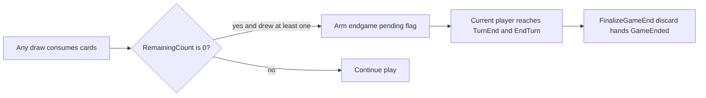

# Deck exhaustion end game

## Rule (interpretation)

- When a **DealCards** consumes at least one card and **`RemainingCount == 0`** afterward, arm **endgame after the active turn-holder’s turn finishes**.
- “Finishes their turn” means **`EndTurn()` runs** — this already happens at the CLI `TurnEnd` prompt and inside **[`TryBustAndEndTurn`](TrashAnimal/GameSession.cs)** (bust abandonment path advances the turn in one jump).
- On finalize: **all players discard every card left in [`Hand`](TrashAnimal/Hand.cs)** onto [`DiscardPile`](TrashAnimal/GameSession.cs); **stash piles are untouched** (rule only mentions hands).

This matches steals/Bandit where a **non–turn-holder** draws the last deck card while the seat in [`CurrentPlayerIndex`](TrashAnimal/GameSession.cs) is still responsible for completing the phase and ending the turn.

## Out of scope (follow-up plan)

- The **rules** for how each player’s score is computed from stashes, discard, tie-breakers, etc.
- The **exact** ranked winner list formatting (beyond a stub or placeholder ordering).

This deck-exhaustion plan still **defines the call site**: once `State == GameEnded`, the engine runs **one** final-score pass (initially a stub or minimal placeholder) before any user dismissal; the follow-up session fills in calculation and presentation details.

## API and session core

1. **[`IDrawPile`](TrashAnimal/IDrawPile.cs)**  
   Add `int RemainingCount { get; }` (document that it reflects pile size **after** any `DealCards` effects).

2. **[`Deck`](TrashAnimal/Deck.cs)**  
   Implement `RemainingCount` (same semantics as [`GetDeckCount`](TrashAnimal/Deck.cs)).

3. **Test stub** **[`EmptyDrawPile`](TrashAnimal.Tests/GameSessionBustAbandonEndTurnTests.cs)**  
   Implement `RemainingCount => 0` so tests keep compiling.

4. **`GameSession` (partial; keep files under ~400 lines)**  
   - Add `_endGamePendingAfterCurrentTurn` (private bool).  
   - Add `internal void RegisterDrawOutcome(IReadOnlyList<Card> dealt)` (or equivalent name): if `dealt.Count > 0 && _drawPile.RemainingCount == 0`, set the flag.  
   - **`EndTurn()`** ([lines 317–324](TrashAnimal/GameSession.cs)): if `_endGamePendingAfterCurrentTurn`, call **`FinalizeGameEnd()`** (clear token coordinator steal noise as needed), then **`return`** **without** `CurrentPlayerIndex` wrap or `BeginTurn()`. Else keep existing advance + `BeginTurn()`.  
   - **`FinalizeGameEnd()`**: for each [`Player`](TrashAnimal/Player.cs), copy hand cards → `DiscardPile`, then `Hand.Clear()`; set `State = GameState.GameEnded`; clear `_tokenPhaseCoordinator` if still active. (Deck exhaustion is the only trigger for this path in the current scope.)

5. **[`GameState`](TrashAnimal/GameState.cs)**  
   Add `GameEnded`.

6. **`GameEnded` interaction model** ([`GameSession.cs`](TrashAnimal/GameSession.cs)):
   - **`GetAllowedActionsForPlayer`**: for every player index, return **no** [`GameAction`](TrashAnimal/GameAction.cs)s—there is nothing left to play through the action pipeline.
   - **`ApplyAction`**: if `State == GameEnded`, reject immediately with a clear error (e.g. `"The game has ended."`). No `GameAction` represents `gg`; **do not** add a `GameAction` for quitting.
   - **Final score**: this boundary is where **final score is produced once**—e.g. call from **`FinalizeGameEnd()`** tail or a dedicated **`BuildGameEndScoreSummary()`** (name as you prefer) that returns data for the CLI to print. Until the follow-up scoring plan exists, implement a **stub** (empty list, zeros, or “scores TBD”) so the pipeline and tests have a stable hook; the follow-up plan replaces the stub body and adds winner ordering.

## Call `RegisterDrawOutcome` after every draw

Centralize calls so exhaustion is tied to **`dealt.Count > 0`**, not “pile was nonempty before acting”:

| Location | After |
|----------|--------|
| [`TryBustAndEndTurn`](TrashAnimal/GameSession.cs) | `_drawPile.DealCards(1).ToList()` |
| [`TokenPhaseTokenResolver.TryStashTrashDraw`](TrashAnimal/TokenPhase/Services/TokenPhaseTokenResolver.cs) | Deal + add |
| [`TokenPhaseTokenResolver.RunDoubleTrashDraws`](TrashAnimal/TokenPhase/Services/TokenPhaseTokenResolver.cs) | Deal(2).ToList() + add |
| [`TokenPhaseBanditHandler.TryBanditStashMatchingCard`](TrashAnimal/TokenPhase/Services/TokenPhaseBanditHandler.cs) | Deal(1).ToList() + add |
| [`TokenPhaseBanditHandler.StartBandit`](TrashAnimal/TokenPhase/Services/TokenPhaseBanditHandler.cs) | Successful draw (`drawn` list before add) |
| **Doggo steal** | **[`StealAttempt.TryPlayDoggo`](TrashAnimal/StealAttempt.cs)** should materialize `DealCards(2).ToList()` and expose that list via `out`/return to caller; **[`TryStealPlayDoggo`](TrashAnimal/GameSession.StealYumRoll.cs)** calls `RegisterDrawOutcome` |

Roll-phase handlers do not call [`DealCards`](TrashAnimal); no changes there.

## CLI and views

7. **[`Program.cs`](TrashAnimal/Program.cs)** — when `session.State == GameState.GameEnded`, **short-circuit the main game loop** into an end screen:
   - Print **final scores** using the session’s game-end summary API (stub content until the scoring plan lands).
   - Prompt the user to type **`gg`** to exit; treat input as a match when it equals **`gg`** **case-insensitively** (e.g. trim, then `OrdinalIgnoreCase`).
   - **Loop** until input matches; then **exit the process** (or return from `Main`). Do not route `gg` through `ApplyAction` / controllers.

8. **[`GameView`](TrashAnimal/GameView.cs)** already carries [`GameState`](TrashAnimal/GameState.cs); no structural change strictly required unless you want `RemainingCount` exposed for HUD — optional.

## Tests

9. **`TrashAnimal.Tests`**: introduce a **`CountingDrawPile : IDrawPile`** (small, e.g. N identical cards) implementing `DealCards` + `RemainingCount`, plus cases such as:

   - **Last card drawn on bust abandon**: pile has 1 card; `TryBustAndEndTurn` drains it → `GameEnded`, both hands emptied to discard pile, **Bob never becomes current** (advance must not run).  
   - **Last card drawn mid–token-phase** (e.g. `TryStashTrashDraw`): flag arms; simulate `AdvanceToResolveTokens`/token completion to `TurnEnd`, then `EndTurn` → `GameEnded`.

Existing bust tests keep passing because **no cards are dealt** from `EmptyDrawPile`, so the endgame flag stays off.
