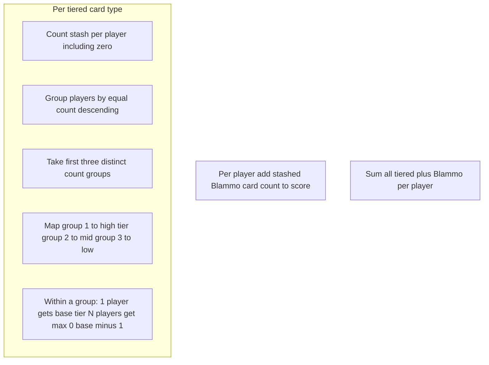

# End-game scoring and `ScoreManager`

## Domain facts (already in repo)

- [`CardName`](TrashAnimal/CardName.cs): `Blammo`, `Nanners`, `Feesh`, `Shiny`, `Yumyum`, `MmmPie`, `Kitteh`, `Doggo`.
- Tier triples are documented in [`Deck.cs`](TrashAnimal/Deck.cs) (lines 25–65): **Yumyum (4,2,0)**, **Shiny (3,0,0)**, **Nanners (7,0,0)**, **MmmPie (6,2,1)**, **Feesh (5,3,1)**. **Blammo**: 1 point per stashed card (no cross-player ranking). **Kitteh / Doggo**: no end-game points (exclude from ranked types entirely).
- Stashes are [`Player.StashPile`](TrashAnimal/Player.cs) / [`StashEntry`](TrashAnimal/StashEntry.cs); every entry has a [`Card`](TrashAnimal/Card.cs) with `Name` — count by `CardName` regardless of face-up (scoring is by card identity).
- End hook today: [`GetGameEndScoreSummary`](TrashAnimal/GameSession.GameEnd.cs) returns stub zeros; [`Program.cs`](TrashAnimal/Program.cs) prints `PlayerName: TotalScore` when `GameState.GameEnded`.

## Scoring rules (implementation model)

- **Ranked types** (run the flow above once each): `Yumyum`, `Shiny`, `Nanners`, `MmmPie`, `Feesh`.
- **Blammo**: for each player, add that player’s stashed Blammo **count** to their total (1 point per card; independent of other players).
- **Tie within a tier slot**: if a distinct-count group has more than one player, each member receives `max(0, tierValue - 1)` for that slot. This covers middle/low tiers that are `0` (e.g. Shiny) without going negative.
- **More than three distinct positive (or zero) ranks**: only the first three distinct count **levels** receive tier slots; everyone in the fourth-and-lower distinct levels gets **0** for that card type (matches your four-player MmmPie example where the player with the fewest gets nothing when four different counts exist).

**Winner** (after final totals):

1. Max **total score**.
2. If tied: max **distinct `CardName` count in stash** (your “unique types” rule).
3. If still tied: max **total cards in stash** (`StashPile.Count`).
4. If still tied (identical on all three — possible in degenerate empty-stash cases): **deterministic fallback** — lowest `Player.Index` — so behavior is stable and testable; document in XML on the public API.

## Code layout (file length / grouping)

Add a small folder, e.g. [`TrashAnimal/Scoring/`](TrashAnimal/Scoring/):

- **`CardEndGameScoringCatalog`** (or similar): immutable description of which names are ranked vs flat vs excluded, and the `(high, mid, low)` triple. Keeps numbers in one place instead of only in `Deck` comments (comments can stay as duplicate documentation or be shortened to “see catalog”).
- **`TieredCardScoringCalculator`**: owns **only** the ranked-type algorithm (per-player counts in → per-player points out for one `CardName` and one tier triple). No `Player` dependency if practical: pass `IReadOnlyList<int>` counts aligned to player index order, or a small read-only DTO. **Do not** embed this logic inside `ScoreManager`.
- **`ScoreManager`**: instance class; constructor takes catalog and a `TieredCardScoringCalculator` (or construct the calculator internally but as a **separate type and file**). Responsibilities: build per-player stash counts from `Player.StashPile`, loop ranked types and add calculator output to running totals, add Blammo counts, compute **`GameEndResult`** (score lines + `WinningPlayerIndex` after tiebreakers). Public method such as `ComputeResult(IReadOnlyList<Player> players)` returning **`GameEndResult`** with:
  - `IReadOnlyList<GameEndScoreLine> ScoreLines` (ordered by `PlayerIndex` for stable UI),
  - `int WinningPlayerIndex` (after tiebreakers).

Evolve [`GameEndScoreLine`](TrashAnimal/GameEndScoreLine.cs): keep `PlayerIndex`, `PlayerName`, `TotalScore`; optionally add `int UniqueStashCardTypes` and `int TotalStashedCards` for transparency and easier tests (still one small record).

**Session wiring** ([`GameSession.GameEnd.cs`](TrashAnimal/GameSession.GameEnd.cs)):

- Field: `GameEndResult? _cachedGameEndResult` (or similar) set once inside `FinalizeGameEnd()` after hands are discarded to the discard pile but **before** clearing state, by calling `new ScoreManager().ComputeResult(_players)` (or a field-injected `ScoreManager` if you prefer a ctor parameter later — start with `new` to minimize `GameSession` constructor churn).
- `GetGameEndScoreSummary()`: return `_cachedGameEndResult!.ScoreLines` (throw if null / game not ended).
- Add `GetGameEndResult()` (or `TryGetGameEndResult`) returning the full object for CLI winner line.

**CLI** ([`Program.cs`](TrashAnimal/Program.cs)): after printing each line, print a single winner line using `GetGameEndResult().WinningPlayerIndex` (name from lines).

## Tests

- **New** [`TrashAnimal.Tests/TieredCardScoringCalculatorTests.cs`](TrashAnimal.Tests/TieredCardScoringCalculatorTests.cs): unit tests on the calculator only (count vectors / tier triples) — MmmPie-style ranks, Shiny `0` tiers with ties, etc.
- **New** [`TrashAnimal.Tests/ScoreManagerTests.cs`](TrashAnimal.Tests/ScoreManagerTests.cs): `Player` + stash integration — Blammo sum, winner / tiebreaker chains (including full three-way tie → index fallback), end-to-end totals.
- **Update** [`GameSessionDeckExhaustionTests.cs`](TrashAnimal.Tests/GameSessionDeckExhaustionTests.cs): `GetGameEndScoreSummary_returns_stub_lines_after_GameEnded` — replace “all zero” with “scores computed from stashes at end” (likely still **0** if no stashed cards in that scenario) and assert **winner index** is deterministic when all zeros (or assert `WinningPlayerIndex == 0`).

## Constraints checklist

- **No partial classes** for new types (existing `GameSession` partial unchanged except calling into `ScoreManager`).
- **Avoid static** on `ScoreManager` and `TieredCardScoringCalculator`; table lives in catalog instance or records.
- Keep each new file **well under 500 lines**; tiered rank/tie/slot logic stays in **`TieredCardScoringCalculator`**, not in `ScoreManager`.
