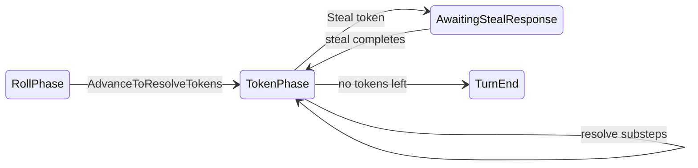

# Phase 2 (TokenPhase) resolution plan

## Current behavior (baseline)

- [`GameSession.GoToPhaseTwo`](c:\Users\Seth\Source\Repos\TrashAnimal\TrashAnimal\GameSession.cs) sets `State = TokenPhase`, immediately calls [`IPhaseTwo.ResolvePhaseTwo`](c:\Users\Seth\Source\Repos\TrashAnimal\TrashAnimal\IPhaseTwo.cs), then sets `State = TurnEnd`. There is **no** interactive TokenPhase in the session loop today.
- Roll-phase tokens are **unique by `TokenAction`** ([`PhaseOneState.TryRollForToken`](c:\Users\Seth\Source\Repos\TrashAnimal\TrashAnimal\PhaseOneState.cs) busts on duplicates), so the player’s pending list is a **set** of at most six values—ordering is a permutation of that set.
- [`HandEntry.NewlyAdded`](c:\Users\Seth\Source\Repos\TrashAnimal\TrashAnimal\HandEntry.cs) is cleared only in [`BeginTurn`](c:\Users\Seth\Source\Repos\TrashAnimal\TrashAnimal\GameSession.cs) (`ClearNewlyAddedFlags`), so it already represents “received this turn” for gating.
- [`StealAttempt`](c:\Users\Seth\Source\Repos\TrashAnimal\TrashAnimal\StealAttempt.cs) + [`StealTargetZone.Hand`](c:\Users\Seth\Source\Repos\TrashAnimal\TrashAnimal\StealTargetZone.cs) already support hand steals; [`StealPickSlotBuilder`](c:\Users\Seth\Source\Repos\TrashAnimal\TrashAnimal\StealPickSlotBuilder.cs) hides hand card names from the thief.
- **Bug-shaped coupling today:** `TryStealPlayDoggo` / `TryCompleteStealWithCard` / `ClearStealChain` assume steal always returns to **RollPhase** ([`GameSession.cs`](c:\Users\Seth\Source\Repos\TrashAnimal\TrashAnimal\GameSession.cs) ~252–270, 411–415). TokenPhase must introduce an explicit **“return state after steal”** (e.g. `GameState? _resumeStateAfterSteal` or a tiny `StealSessionOrigin` enum: `RollPhase` vs `TokenPhase`) so completion and `ClearStealChain` restore **`TokenPhase`** when the steal began there.

## Target rules (encoded in code)

**Token queue**

- On `AdvanceToResolveTokens` / bust abandon: copy `PhaseOne.Tokens` into a mutable **remaining-tokens** structure (e.g. `HashSet<TokenAction>` or `List<TokenAction>` since values are unique).
- Player repeatedly chooses **one remaining token** to resolve; when the list is empty, transition to `TurnEnd` (same end condition as today).

**Hand vs stash eligibility (current player)**

- **After token resolution has started** (recommended default: after the player **chooses the first token** to resolve from the remaining pool—clear milestone, allows optional “setup” if you ever need it; if you prefer lock on `TokenPhase` entry, it is a one-line policy change):
  - **Cannot use for card actions** any hand entry with `NewlyAdded == true`.
  - **Cannot use for card actions** `Blammo`, `Nanners`, `Yumyum` regardless of `NewlyAdded`.
  - **May use when appropriate** `Shiny`, `Feesh`, `Doggo`, `Kitteh`, `MmmPie` subject to `NewlyAdded` and existing situational rules (e.g. Feesh needs discard + selector).
- **Shiny in TokenPhase:** **unchanged** from RollPhase—still **stash only**, still requires at least one opponent with a non-empty stash and the victim selector; never steal from hand via Shiny.
- **Stash prompts** (DoubleStash / StashTrash branch / Bandit responses): offer every hand card **except** `Doggo` and `Kitteh`, **including** `NewlyAdded` cards.

Centralize eligibility in **instance-based** helpers (e.g. inject `TokenPhaseCardEligibility` or a small non-static `TokenPhaseRules` service constructed with session/player context). **Do not use the `static` keyword** for new plan code (prefer instance methods on dedicated types used by the coordinator/handlers).

**Per-token behavior** ([`TokenAction`](c:\Users\Seth\Source\Repos\TrashAnimal\TrashAnimal\TokenAction.cs))

| Token | Behavior |
|-------|----------|
| `StashTrash` | Choice: draw 1 from [`IDrawPile`](c:\Users\Seth\Source\Repos\TrashAnimal\TrashAnimal\IDrawPile.cs) **or** stash exactly one stash-eligible card face **down**. |
| `DoubleStash` | Choose 0, 1, or 2 stash-eligible cards from hand; each stashed face **down**. |
| `DoubleTrash` | Draw 2 from draw pile (may be fewer if deck exhausted—match `DealCards` semantics). |
| `Bandit` | Draw top; **reveal** `CardName` to all players; add card to current player’s hand (`NewlyAdded` as appropriate). Then in **fixed clockwise order** from the current player (reuse [`GetOpponentIndicesClockwise`](c:\Users\Seth\Source\Repos\TrashAnimal\TrashAnimal\GameSession.cs)), each other player may **pass** or **stash one matching card** (same `CardName`) face **up**; for each stash, current player draws one card. |
| `Steal` | Current player picks a victim with a non-empty hand (inject `Func` similar to `ChooseShinyStealVictim`); start [`StealAttempt.Begin`](c:\Users\Seth\Source\Repos\TrashAnimal\TrashAnimal\StealAttempt.cs)(…, `StealTargetZone.Hand`); reuse existing `AwaitingStealResponse` / `AwaitingStealCardPick` + `TrySteal*` / `TryCompleteStealWithCard` with return-state fix. |
| `Recycle` | Remove `Recycle` from remaining; player chooses a `TokenAction` **not present in the initial phase-2 token multiset** (snapshot taken at TokenPhase entry); add that token to **remaining** (so it must still be resolved this phase). |

**Mmmpie**

- New roll-phase–style action, e.g. `GameAction.PlayMmmPieInTokenPhase` (or a single `PlayMmmPie` if you centralize state checks).
- When played: discard `MmmPie` from hand (respect `NewlyAdded` + “resolution started” rules as above); set **`_resolveCurrentTokenTwice`** (bool on `TokenPhaseState` or coordinator) so the **currently resolving token’s** full effect runs twice—after the first full resolution pass, run the same token logic again (e.g. StashTrash: two full draw-or-stash cycles). Clear the flag when that token is fully done.

**`IPhaseTwo` and DI**

- The interface’s synchronous `ResolvePhaseTwo` is incompatible with multi-step Bandit / steal. **Remove it from the hot path**: either delete `IPhaseTwo` / [`PhaseTwoNoop`](c:\Users\Seth\Source\Repos\TrashAnimal\TrashAnimal\PhaseTwoNoop.cs) and ctor injection, or reduce to a no-op **observer** if you still want a hook for logging—**do not** resolve game rules inside it.
- Update [`Program.cs`](c:\Users\Seth\Source\Repos\TrashAnimal\TrashAnimal\Program.cs) and tests that construct `GameSession` accordingly.

## Session architecture

- Add a dedicated **`TokenPhaseState`** (new file under e.g. [`TrashAnimal/TokenPhase/`](c:\Users\Seth\Source\Repos\TrashAnimal\TrashAnimal)) holding: remaining tokens, initial multiset snapshot for Recycle, `TokenPhaseStep` (enum: e.g. `ChooseNextToken`, `StashTrashChoose`, `DoubleStashPick`, `BanditAwaitOpponent`, …), Bandit context (revealed `CardName`, opponent index), **`ResolveCurrentTokenTwice`** (bool, Mmmpie), and “first token chosen” flag for hand lock.
- **Split [`GameSession.cs`](c:\Users\Seth\Source\Repos\TrashAnimal\TrashAnimal\GameSession.cs)** (423 lines, over the 400-line workspace rule): introduce an instance **`TokenPhaseCoordinator`** that owns TokenPhase transitions and the **TokenPhase-specific** branches of `GetAllowedActionsForPlayer` / `ApplyAction` (delegate from `GameSession` when `State == TokenPhase` or relevant substeps). RollPhase / YumYum / steal plumbing can stay on `GameSession` until a later split if needed; priority is staying under the file-length rule.
- Extend [`GameAction`](c:\Users\Seth\Source\Repos\TrashAnimal\TrashAnimal\GameAction.cs) with the minimum set of discrete actions (token pick, StashTrash branch, DoubleStash count/picks, Bandit pass/stash, Recycle pick, Mmmpie, TokenPhase Shiny/Feesh if exposed the same way as roll phase). Prefer **structured parameters** via new `Try*` methods on `GameSession` (pattern already used for steal card pick) rather than encoding every choice as a unique enum value if that explodes.
- Add a composed **`TokenPhaseView`** record (dedicated file, e.g. [`TokenPhaseView.cs`](c:\Users\Seth\Source\Repos\TrashAnimal\TrashAnimal\TokenPhaseView.cs)) and add **one** optional property on [`GameView`](c:\Users\Seth\Source\Repos\TrashAnimal\TrashAnimal\GameView.cs), e.g. `TokenPhaseView? TokenPhase`, holding: remaining tokens, current sub-step, revealed Bandit card (when relevant), current Bandit responder index, etc.—**avoid** flattening many new fields onto `GameView` itself.

## Integration checklist

- **Selectors (inject on `GameSession`, same style as Feesh/Shiny):** victim for Steal token; optional helpers for “which card to stash” if you keep CLI dumb and pass indices/IDs.
- **Draw marking:** any draw to the **current turn player** during TokenPhase should use `Player.AddCards(..., markReceivedOnOwnerCurrentTurn: true)` (see [`Player.AddCards`](c:\Users\Seth\Source\Repos\TrashAnimal\TrashAnimal\Player.cs)).
- **Steal return state:** when beginning steal from TokenPhase, set resume = `TokenPhase`; on Doggo completion / pick completion / Kitteh swap, clear steal and set `State` from resume; ensure `ClearStealChain` respects resume or is replaced with origin-aware clearing.
- **CLI / AI:** extend [`CliHumanController`](c:\Users\Seth\Source\Repos\TrashAnimal\TrashAnimal\CliHumanController.cs) / [`AiController`](c:\Users\Seth\Source\Repos\TrashAnimal\TrashAnimal\AiController.cs) and [`Program.cs`](c:\Users\Seth\Source\Repos\TrashAnimal\TrashAnimal\Program.cs) loop to handle `TokenPhase` and new substates (mirroring existing steal/YumYum branches).

## Testing

- **Unit tests** (new file(s) under `TrashAnimal.Tests/`): remaining-token order independence; hand-lock (`NewlyAdded` + forbidden names); stash eligibility (Doggo/Kitteh excluded, new draws included); Recycle only allows types absent from initial snapshot; Bandit: N opponents stash → N draws; Steal token enters steal states and returns to TokenPhase with correct remaining tokens; Mmmpie doubles StashTrash / DoubleTrash in a controlled scenario.
- Update existing tests that pass `PhaseTwoNoop` into `GameSession` ctor.

