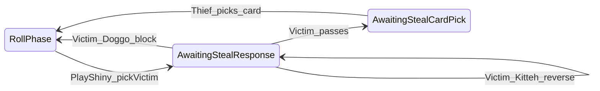

# Shiny card, Stash Pile, and reusable steal flow

## Current code touchpoints

- Shiny is already a [`GameAction.PlayShiny`](TrashAnimal/GameAction.cs) and [`TryPlayShinyOrFeesh`](TrashAnimal/GameSession.cs) removes the card to [`DiscardPile`](TrashAnimal/GameSession.cs) and only fires [`OnShinyPlayed`](TrashAnimal/GameSession.cs) (stub in [`Program.cs`](TrashAnimal/Program.cs)).
- There is **no** stash structure on [`Player`](TrashAnimal/Player.cs) yet; [`IPhaseTwo`](TrashAnimal/IPhaseTwo.cs) / [`PhaseTwoNoop`](TrashAnimal/PhaseTwoNoop.cs) do not add cards to a stash (future token resolution).
- [`scenarios.txt`](TrashAnimal/scenarios.txt): Shiny targets **stash** only (lines 20–27, 79–91). **`PlayShiny`** appears only when **at least one opponent** has **at least one card in their stash**.

## Shiny: stash pile only

- **Shiny never steals from a player’s hand.** The thief chooses **which opponent’s stash** to target (among opponents with `StashPile.Count >= 1`).
- **Eligibility** ([`GetAllowedActionsForPlayer`](TrashAnimal/GameSession.cs)): include `PlayShiny` only if some opponent has stash cards (same gate as above).

## Reusable steal mechanic (zone, for Shiny now and TokenPhase later)

Implement the pass / Doggo / Kitteh / card-pick flow **once**, parameterized by **steal target zone** (`Hand` | `Stash`):

| Zone | When used (this plan) | When used (later, out of scope) |
|------|------------------------|----------------------------------|
| **Stash** | **Shiny** — only entry point in this work | Could be reused if another effect steals from stash |
| **Hand** | *Not* started by Shiny | **Token action during TokenPhase** — will call the same steal flow with `InitialStealTargetZone = Hand` |

- **Victim** = player being stolen from (responder: pass / Doggo / Kitteh).
- **Kitteh**: only swap thief/victim; **`InitialStealTargetZone`** is set **once** when the chain starts and **never changes** (for Shiny it is always **Stash**; when a future token starts a hand steal, it will be **Hand** for that chain).
- **Thief-facing pick labels** (after pass):
  - **Stash**: face-up → real [`CardName`](TrashAnimal/CardName.cs); face-down → **`Unrevealed Card`**.
  - **Hand**: every slot → **`Unrevealed Card`** (no names to thief)—used when the shared flow is invoked from the future token action.

Session fields (illustrative): `StealingPlayerIndex`, `VictimIndex`, `InitialStealTargetZone` (`Hand` | `Stash`).

## Domain model: Stash Pile

- Add a small type (e.g. `StashEntry`) holding a [`Card`](TrashAnimal/Card.cs) plus **face-up vs face-down**. Lives on [`Player`](TrashAnimal/Player.cs) as e.g. `StashPile`.
- API sketch: `AddToStash(Card card, bool faceUp)`, remove by `Guid` for steals, read-only projections for views.
- **Owner view**: victim sees full stash. **Thief view** (stash steal): names only where face-up; else **`Unrevealed Card`**.

## Game state machine (steal chain)

Branch in the main loop like Yum Yum ([`Program.cs`](TrashAnimal/Program.cs), [`GameState.AwaitingYumYum`](TrashAnimal/GameState.cs)).

- **`PlayShiny` setup** ([`TryPlayShinyOrFeesh`](TrashAnimal/GameSession.cs)):
  1. [`GameState.RollPhase`](TrashAnimal/GameState.cs), active phase one (unchanged).
  2. Eligibility: some opponent has `StashPile.Count >= 1`.
  3. Controller picks **victim index** only (opponent with non-empty stash). Validate before removing Shiny (Feesh-style).
  4. Discard Shiny, set thief = current player, victim, **`InitialStealTargetZone = Stash`**, `GameState.AwaitingStealResponse`.
- **Responder actions** (`StealPass`, `StealPlayDoggo`, `StealPlayKitteh`): pass → card pick; Doggo → block + victim draws two; Kitteh → swap thief/victim; zone unchanged.

*Future:* TokenPhase hand-steal will enter the same states from [`IPhaseTwo`](TrashAnimal/IPhaseTwo.cs) (or equivalent) with zone `Hand` and its own eligibility (out of scope for this plan).

## Successful steal: card pick

- After pass, thief completes pick via e.g. `TryCompleteStealWithCard(int playerIndex, Guid cardId, out string?)`.
- Validate `cardId` against the **victim’s stash or hand** per **`InitialStealTargetZone`**; move [`Card`](TrashAnimal/Card.cs) to thief’s hand; clear steal; return to **RollPhase** for Shiny (TokenPhase return state is TBD when that work lands).

## Deck draws (Doggo)

- Inject a draw source into [`GameSession`](TrashAnimal/GameSession.cs) (e.g. [`Deck`](TrashAnimal/Deck.cs) or `IDrawPile`) for two cards on block; define behavior when fewer than two cards remain.

## `GetAllowedActionsForPlayer` and views

- Steal response: only **victim** sees pass + Doggo/Kitteh; card pick: only **thief**.
- [`GameView`](TrashAnimal/GameView.cs): steal context includes **`InitialStealTargetZone`** and thief-facing pick slots. Update [`CliHumanController`](TrashAnimal/CliHumanController.cs) / [`AiController`](TrashAnimal/AiController.cs) / [`Program.cs`](TrashAnimal/Program.cs).

## Hooks cleanup

- Trim or repurpose [`OnShinyPlayed`](TrashAnimal/GameSession.cs) once the session owns Shiny resolution.

## Testing / SOLID note

- Prefer a small **`StealAttempt`** helper or similar so Shiny and future token hand-steal share logic without bloating [`GameSession`](TrashAnimal/GameSession.cs) ([File-Length-and-Structure](.cursor/rules/File-Length-and-Structure.mdc)).
- Tests for **this plan**: Shiny stash path, visibility (face-up vs face-down), pass/Doggo/Kitteh, initial zone stays **Stash** across reversals, `PlayShiny` absent when all opponent stashes empty. Optional: unit-test **Hand** zone branch in isolation for the shared helper (no Shiny entry).

## Dependency order

1. Stash on `Player` + zone-aware pick slot builder (`Hand` vs `Stash` labels).  
2. Deck draw injection for Doggo.  
3. `GameState` + reusable steal fields/transitions (`InitialStealTargetZone`).  
4. `GameAction` / `ApplyAction` / `GetAllowedActionsForPlayer` + Shiny victim selection only.  
5. Wire `Program` + controllers.  
6. Later: TokenPhase token + `AddToStash` from token resolution.

## Note on `scenarios.txt`

Matches stash-only Shiny (lines 20–27, 79–91). No Shiny-from-hand scenarios.
