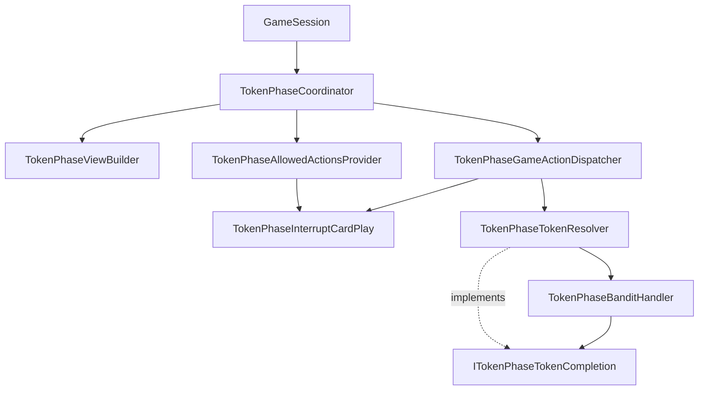

# Refactor `TokenPhaseCoordinator` with composition (no partial classes)

## Goals

- **No `partial` classes** on `TokenPhaseCoordinator`.
- **Composition:** coordinator owns `_state` (and optionally a single shared `TokenPhaseCardEligibility` instance) and delegates to small **internal** collaborators.
- **SOLID (practical mapping):**
  - **S**ingle responsibility: one type per concern (view projection, allowed-actions policy, Bandit window, bonus cards during token phase, token resolution / subflows, game-action dispatch).
  - **O**pen/closed: extend behavior via new handlers or new `GameAction` branches in the dispatcher without growing the façade.
  - **L**iskov: **`ITokenPhaseTokenCompletion`** is the intentional abstraction for tests or alternate completion rules; keep other collaborators as concrete internal types unless a second implementation is needed.
  - **I**nterface segregation: introduce **`ITokenPhaseTokenCompletion`** as the only completion abstraction—small methods (e.g. finish-or-repeat, restart subflow as needed) rather than a wide `ITokenPhaseCoordinator`.
  - **D**ependency inversion: services depend on `GameSession`, `TokenPhaseCardEligibility`, and **`ITokenPhaseTokenCompletion`** (implemented by `TokenPhaseTokenResolver`) instead of the full coordinator type.

## Current consumer

- [`GameSession.cs`](c:/Users/Seth/Source/Repos/TrashAnimal/TrashAnimal/GameSession.cs) is the only constructor site for `TokenPhaseCoordinator`. **Public surface of `TokenPhaseCoordinator` should stay stable** unless you deliberately choose to expose sub-services (not recommended).

## Shared state and avoiding circular dependencies

- **`TokenPhaseCoordinator`** remains the **owner** of `TokenPhaseState?` and the **single place** that sets `_state` to null in `Clear` / completion.
- Collaborators receive **`GameSession`** and **`TokenPhaseCardEligibility`** in their constructors (or method parameters where that reads clearer).
- For flows that must chain into **`FinishCurrentTokenPassOrRepeat`** / **`RestartSubflow`** (today private on the coordinator), use an internal **`ITokenPhaseTokenCompletion`** interface (e.g. `bool TryFinishCurrentTokenPassOrRepeat(TokenPhaseState state, out string? error)` and any other members Bandit/subflows need, such as restart-after-repeat if that stays outside the Bandit handler). Implement it **once** on **`TokenPhaseTokenResolver`**, which owns that logic; **`TokenPhaseBanditHandler`** takes `ITokenPhaseTokenCompletion` in its constructor and calls it from `AdvanceBanditWindow` / `FinishBanditToken` paths instead of duplicating completion rules. **Do not** use delegates or `Func<...>` for this cross-cutting completion wiring.

Avoid services holding a reference to **`TokenPhaseCoordinator`**—that recreates a god object and tight coupling.

## Proposed layout (under `TrashAnimal/TokenPhase/`)

Use a subfolder to keep the coordinator file from becoming a dumping ground, e.g. **`TokenPhase/Services/`** (name is descriptive; `Handlers/` is an acceptable alternative).

| Type | File | Responsibility |
|------|------|----------------|
| `TokenPhaseCoordinator` | [`TokenPhaseCoordinator.cs`](c:/Users/Seth/Source/Repos/TrashAnimal/TrashAnimal/TokenPhase/TokenPhaseCoordinator.cs) | Holds `_session`, `_eligibility`, `_state`; `Begin` / `Clear` / `IsActive`; delegates `BuildView`, `GetAllowedActions`, `TryApplyGameAction`, Bandit and subflow `Try*` methods, `OnStealResolvedWhileInTokenPhase`, `ActiveTokenIsSteal` |
| `TokenPhaseViewBuilder` | `Services/TokenPhaseViewBuilder.cs` | Builds `TokenPhaseView`; stash tuples for prompts; recycle options list; current Bandit responder index |
| `TokenPhaseAllowedActionsProvider` | `Services/TokenPhaseAllowedActionsProvider.cs` | `GetAllowedActions` only; depends on interrupt-card “can play?” API |
| `TokenPhaseInterruptCardPlay` | `Services/TokenPhaseInterruptCardPlay.cs` | `TryPlay*` + `CanPlay*` for MmmPie / Shiny / Feesh |
| `ITokenPhaseTokenCompletion` | `Services/ITokenPhaseTokenCompletion.cs` | Narrow internal contract for “finish current token / pass or repeat” (and related hooks the Bandit handler needs); **no** delegate-based alternative |
| `TokenPhaseBanditHandler` | `Services/TokenPhaseBanditHandler.cs` | `TryBanditPass`, `TryBanditStashMatchingCard`, `AdvanceBanditWindow`, `FinishBanditToken`, `StartBandit`; depends on `ITokenPhaseTokenCompletion` |
| `TokenPhaseTokenResolver` | `Services/TokenPhaseTokenResolver.cs` | Implements `ITokenPhaseTokenCompletion`; owns `TryStartToken`, `RunDoubleTrashDraws`, `StartHandSteal`, stash-trash / double-stash / recycle handlers, `FinishCurrentTokenPassOrRepeat`, `RestartSubflow`, steal victim enumeration |
| `TokenPhaseGameActionDispatcher` | `Services/TokenPhaseGameActionDispatcher.cs` | Maps `GameAction` to the appropriate try-methods (delegates to interrupt cards, token resolver, stash-trash actions) |

**Line budget:** after extraction, each file should stay **well under 400 lines** per workspace rules; if `TokenPhaseTokenResolver` approaches the limit, split **Recycle-only** or **StashTrash-only** into a second internal type.

## Dependency graph (target)

- **`TokenPhaseTokenResolver`** implements **`ITokenPhaseTokenCompletion`**, constructs **`TokenPhaseBanditHandler`** with `(session, eligibility, tokenCompletion: this)` so `TryStartToken` / `RestartSubflow` can call `StartBandit` with **no ctor cycle** (bandit depends only on the interface, not on the resolver’s concrete type).
- **`TokenPhaseBanditHandler`** calls **`ITokenPhaseTokenCompletion`** when the Bandit window advances or finishes so token completion stays in one place (`TokenPhaseTokenResolver`).
- **`TokenPhaseGameActionDispatcher`** takes references to **`TokenPhaseInterruptCardPlay`**, **`TokenPhaseTokenResolver`**, and any **stash-trash** entry points that remain on the resolver.

## Coordinator wiring (constructor)

Example shape (pseudocode intent only):

- Create `_eligibility` once.
- `_viewBuilder = new TokenPhaseViewBuilder(session, _eligibility)`
- `_interruptCards = new TokenPhaseInterruptCardPlay(session, _eligibility)`
- `_tokenResolver = new TokenPhaseTokenResolver(session, _eligibility)` — resolver’s ctor creates **`new TokenPhaseBanditHandler(session, _eligibility, tokenCompletion: this)`** where `this` is the resolver as **`ITokenPhaseTokenCompletion`** (bandit never references the coordinator; no ctor cycle).
- `_allowedActions = new TokenPhaseAllowedActionsProvider(session, _interruptCards, /* state supplied per call */)`
- `_gameActions = new TokenPhaseGameActionDispatcher(session, _interruptCards, _tokenResolver, ...)`

Public methods on the coordinator perform **`if (_state is null)`** guards where they do today, then call the appropriate service with **`_state`** (non-null after guard).

## Out of scope (unless requested)

- Moving [`TokenPhaseView.cs`](c:/Users/Seth/Source/Repos/TrashAnimal/TrashAnimal/TokenPhaseView.cs) into `TokenPhase/`.
- Splitting [`TokenPhaseState.cs`](c:/Users/Seth/Source/Repos/TrashAnimal/TrashAnimal/TokenPhase/TokenPhaseState.cs) / [`TokenPhaseStep.cs`](c:/Users/Seth/Source/Repos/TrashAnimal/TrashAnimal/TokenPhase/TokenPhaseStep.cs) / [`TokenPhaseCardEligibility.cs`](c:/Users/Seth/Source/Repos/TrashAnimal/TrashAnimal/TokenPhase/TokenPhaseCardEligibility.cs`)—already small.

## Verification

- `dotnet build` on the solution; **no intended behavior change**.
- Confirm no file exceeds **500 lines** and nothing lingers near **400** without a follow-up split.
